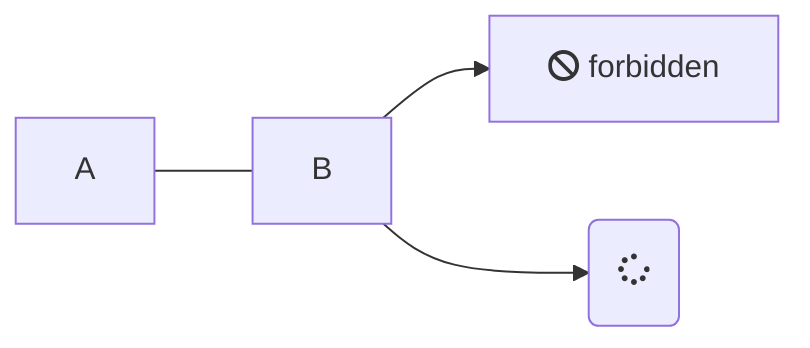

# 項目

## 概要

このブログの構成を説明します。

- リスト
- リスト
- コードありリスト
  ```shell
  $ ls
  ```
- コードありリスト終わり

こんにちは
\
\
\
\
コード

```ts
interface CodeProps {
  children: React.ReactChild;
  className: string;
}
// https://mdxjs.com/guides/syntax-highlighting/#syntax-highlighting-at-run-time
const code: React.FC<CodeProps> = (p: CodeProps) => {
  const match = /language-(\w+)/.exec(p.className || "");

  return match ? (
    <SyntaxHighlighter language={match[1]}>{p.children}</SyntaxHighlighter>
  ) : (
    <SyntaxHighlighter>{p.children}</SyntaxHighlighter>
  );
};
```

```shell
$ mv ./foo ../bar
```



## 参考資料

[Next Js](https://nextjs.org/)
