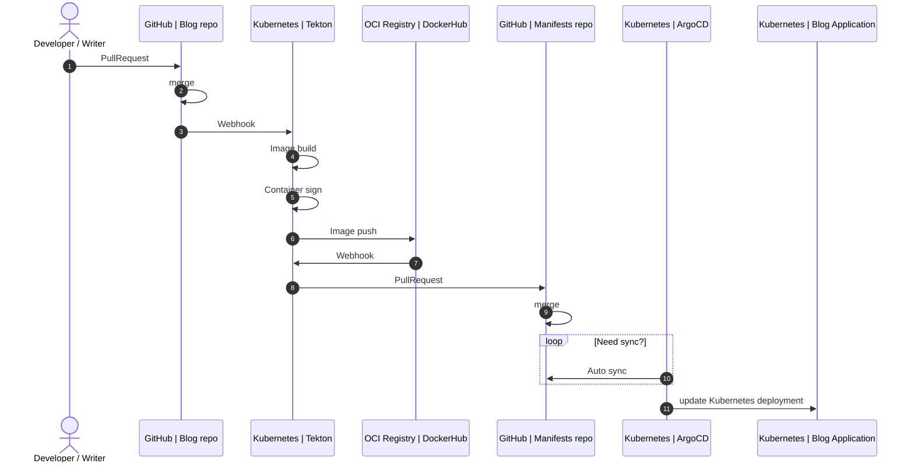

# アーキテクチャ

{/* toc */}

- [概要](#概要)
- [シーケンス図](#シーケンス図)

## 概要

ブログの CI/CD などを真面目に作ったのでアーキテクチャの説明をしておきます。

## シーケンス図

```mermaid
sequenceDiagram
    autonumber
    actor developer as Developer / Writer
    participant blog as GitHub | Blog repo
    participant tekton as Kubernetes | Tekton
    participant dockerhub as OCI Registry | DockerHub
    participant manifests as GitHub | Manifests repo
    participant argocd as Kubernetes | ArgoCD
    participant node as Kubernetes | Blog Application

    developer->>blog: PullRequest
    blog->>blog: merge

    blog->>tekton: Webhook
    tekton->>tekton: Image build
    tekton->>tekton: Container sign
    tekton->>dockerhub: Image push

    dockerhub->>tekton: Webhook
    tekton->>manifests: PullRequest
    manifests->>manifests: merge

    loop Need sync?
      argocd->>manifests: Auto sync
    end
    argocd->>node: update Kubernetes deployment
```
