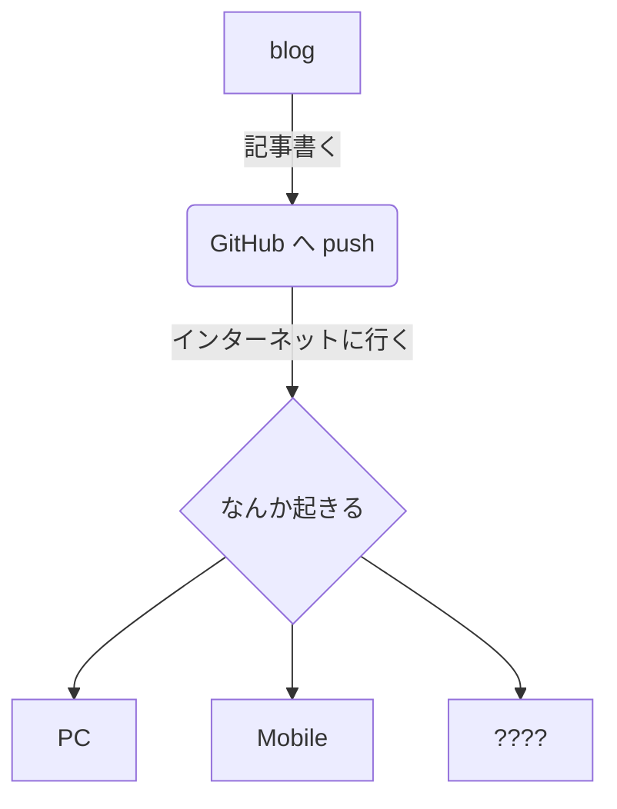

# 最初の投稿

## 紹介

ブログを作りました。何か書いていこうと思います。

## journey


```mermaid
graph TD
    blog[blog] -->|記事書く| gh(GitHub へ push)
    gh --> |インターネットに行く| nanka{なんか起きる}
    nanka --> pc[PC]
    nanka --> mobile[Mobile]
    nanka --> foo[????]
```

## code

```ts
console.log("Hello, 世界");
```

```go
package main

import "fmt"

func main() {
        fmt.Println("Hello, 世界")
}
```
